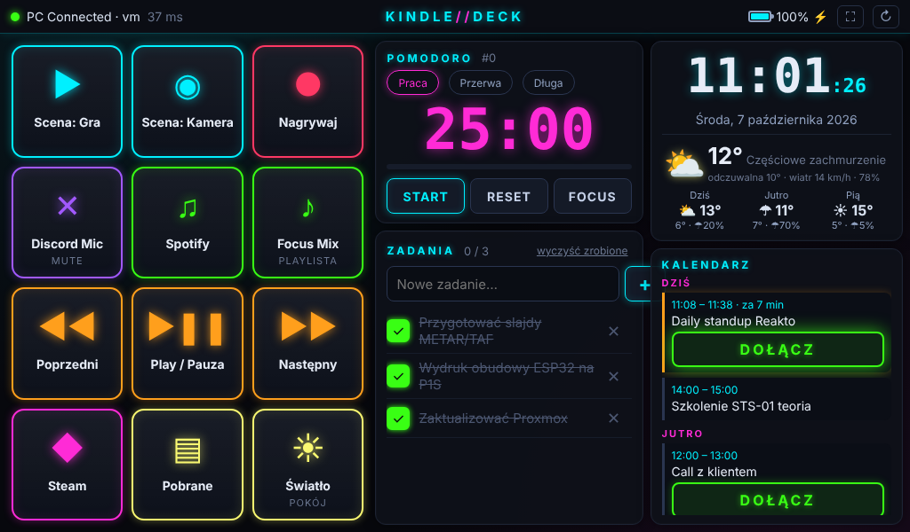
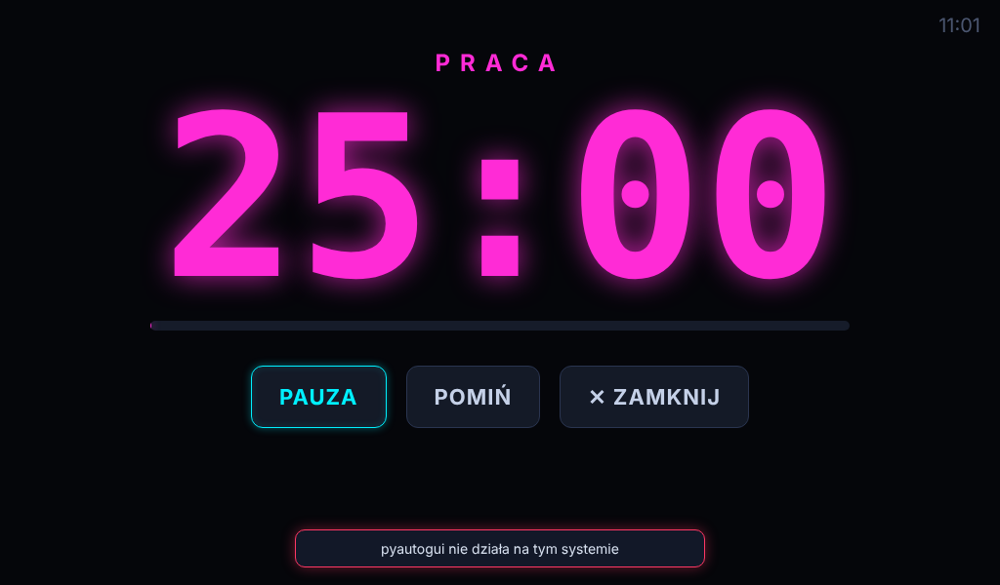

# Kindle Deck — Stream Deck i dashboard na biurko ze starego Kindle Fire

Stary Kindle Fire HD 7 jako dotykowy panel do sterowania PC z Windowsem przez Wi-Fi, a przy okazji podręczne centrum produktywności: lista zadań, Pomodoro, zegar, pogoda i kalendarz z przyciskiem „DOŁĄCZ”.



## Architektura

```
┌──────────── Kindle Fire (Silk / Fully Kiosk) ───────────┐        ┌──────────────── PC (Windows) ─────────────────┐
│  web/index.html + style.css + app.js  (czysty ES5)      │  HTTP  │  server/server.py  (Flask + waitress)         │
│  • siatka 3x4 → POST /api/action/<id>                    │ ─────► │  • serwuje web/ i REST API                     │
│  • to-do      → /api/todos                               │  LAN   │  • actions.py: hotkey, media, open, url,      │
│  • pogoda     → /api/weather   (proxy)                   │ ◄───── │    shell, Home Assistant, OBS, makra          │
│  • kalendarz  → /api/events    (proxy)                   │        │  • proxy Open-Meteo i Google Calendar (ICS)   │
│  • heartbeat  → /api/ping co 5 s                         │        │  • todos.json (lista zadań trzymana na PC)    │
└──────────────────────────────────────────────────────────┘        └────────────────────────────────────────────────┘
```

### Dlaczego tak, a nie inaczej

| Decyzja | Powód |
|---|---|
| **Web app serwowany z PC**, a nie APK | Nie trzeba niczego kompilować pod Fire OS. Poprawiasz plik na PC, klikasz ↻ na tablecie i gotowe. |
| **Czysty ES5 + XHR, bez Tailwinda/Reacta** | Silk/WebView na starym Fire OS nie obsługuje `fetch`, `Promise`, arrow functions, CSS Grid ani zmiennych CSS. Tailwind CDN to duży JIT w nowoczesnym JS, więc na tym tablecie po prostu się nie załaduje. Wygląd w stylu Tailwinda daje ręcznie napisany CSS z prefiksami `-webkit-`. |
| **Pogoda i kalendarz idą przez PC** | Stary Android ma przestarzałe TLS i certyfikaty, więc często nie połączy się z nowoczesnym HTTPS. Tablet rozmawia tylko z PC po zwykłym HTTP w sieci lokalnej. |
| **Tablet wysyła ID przycisku, a nie komendę** | Akcje są zapisane wyłącznie w `config.json` na PC. Nikt w sieci nie odpali dowolnego polecenia, a do tego dochodzi token. |
| **HTTP polling zamiast WebSocketów** | Działa wszędzie, a wykrycie rozłączenia w ciągu 5 s w zupełności wystarcza. Nie trzeba się martwić o wsparcie WebSocket w starym Silk. |
| **To-do zapisywane na PC** | Lista przetrwa reset tabletu i można ją edytować także z przeglądarki na PC (`http://localhost:8765`). |

## Instalacja (PC, Windows)

1. Zainstaluj **Python 3.10+** (przy instalacji zaznacz *Add to PATH*).
2. Uruchom `server\start.bat`. Przy pierwszym starcie utworzy `.venv`, zainstaluje paczki i skopiuje `config.example.json` do `config.json`.
3. **Edytuj `server\config.json`**. Ustaw co najmniej własny `token` i przyciski. Po zmianach zrestartuj serwer.
4. Zapora Windows: przy pierwszym starcie zezwól na dostęp w **sieci prywatnej**. Możesz też dodać regułę ręcznie (PowerShell jako admin):
   ```powershell
   netsh advfirewall firewall add rule name="KindleDeck" dir=in action=allow protocol=TCP localport=8765 profile=private
   ```
5. W konsoli pojawi się adres w stylu `http://192.168.1.50:8765/?token=...`.
6. **Stałe IP:** zrób rezerwację DHCP dla PC w routerze (po adresie MAC), żeby ten adres się nie zmieniał.

**Autostart bez okna konsoli:** `Win+R` → `shell:startup`, a tam skrót do `server\start_hidden.vbs`. Logi trafiają wtedy do `server\deck.log`.

## Instalacja (Kindle Fire)

**Opcja A, polecana: Fully Kiosk Browser** (APK z fully-kiosk.com, bo Amazon Appstore go nie ma):
- Start URL: adres z konsoli serwera (razem z `?token=...`).
- *Web Content Settings*: włącz JavaScript Interface. Dzięki temu dashboard pokazuje poziom baterii.
- *Device Management*: Keep Screen On, opcjonalnie wygaszanie nocą.
- *Kiosk Mode / Fullscreen*: pełny ekran bez pasków.

**Opcja B: Silk Browser.** Otwórz adres, a potem użyj przycisku ⛶ (pełny ekran) w prawym górnym rogu. Poziom baterii w Silk może się nie wyświetlać.

Token zapisuje się w pamięci przeglądarki, więc później wystarczy sam adres. Jeśli token się nie zgadza, tablet poprosi o niego sam.

Layout jest rysowany pod **1024×600** (`viewport width=1024`). Na ekranach 1280×800 przeglądarka skaluje go automatycznie.

## Konfiguracja przycisków (`server/config.json`)

```json
{ "id": "dc_mute", "label": "Discord Mic", "icon": "✕", "color": "#a259ff", "sub": "mute",
  "action": { "type": "hotkey", "keys": ["ctrl", "alt", "shift", "m"] } }
```

Kolejność w tablicy `buttons` odpowiada kolejności na siatce, od lewej do prawej i z góry na dół (12 pól). `icon` to dowolny znak. Unikaj kolorowych emoji, bo stary Fire OS może ich nie mieć w fontach. Bezpieczne są np. `▶ ◀ ● ◉ ✕ ♫ ♪ ☀ ◆ ▤ ⚙ ⌂ ✉`.

| `type` | Parametry | Przykład / uwagi |
|---|---|---|
| `hotkey` | `keys: [...]` | `["ctrl","shift","m"]`, nazwy klawiszy jak w pyautogui |
| `media` | `key` | `playpause`, `next`, `prev`, `stop`, `volup`, `voldown`, `mute` |
| `type` | `text` | wpisuje tekst |
| `open` | `target` | exe, folder, plik, URI: `spotify:`, `steam://open/main`, `%USERPROFILE%\\Downloads` |
| `url` | `url` | otwiera w domyślnej przeglądarce |
| `shell` | `cmd: [...]`, `cwd` | `["powershell","-File","C:\\skrypty\\x.ps1"]` (lista, bez powłoki) |
| `ha` | `service`, `entity_id`, `data` | `"light.toggle"`, `"light.pokoj"`; wymaga `home_assistant.url` + long-lived token |
| `obs_scene` | `scene` | OBS 28+: Narzędzia → Ustawienia WebSocket Server (port 4455 + hasło do `obs`) |
| `obs_mute` | `input` | np. `"Mic/Aux"` |
| `obs_record` / `obs_stream` | – | przełącza nagrywanie / stream |
| `multi` | `steps: [...]` | makro, np. otwórz playlistę → `sleep` 3 s → `playpause` |
| `sleep` | `s` | pauza w makrze (max 10 s) |

**Discord:** Ustawienia → Skróty klawiszowe → „Przełącz wyciszenie” → `Ctrl+Alt+Shift+M`. Skrót jest globalny, więc działa także wtedy, gdy Discord nie jest na pierwszym planie.

**Spotify playlisty:** samo otwarcie URI `spotify:playlist:<id>` nie włącza odtwarzania, dlatego przykład w configu to makro (open → sleep → play). Uwaga: jeśli coś już gra, `playpause` to zatrzyma. Pewniejszym rozwiązaniem byłoby Spotify Web API, opisane w planie rozwoju niżej.

**Kalendarz:** Google Calendar → Ustawienia kalendarza → *Tajny adres w formacie iCal* → wklej go do `calendar_ics_url`. Link do spotkania (Meet/Zoom/Teams/Discord) jest wyciągany z opisu, lokalizacji lub danych konferencji. „DOŁĄCZ” otwiera go **na PC**. Tablet przesyła wyłącznie ID wydarzenia, nigdy sam URL.

**Pomodoro:** czasy ustawisz w sekcji `pomodoro`. `on_work_start` / `on_break_start` przyjmują ID przycisku albo akcji z `hidden_actions`, np. żeby na start sesji pracy włączyć tryb „Nie przeszkadzać”. Przerwa startuje automatycznie, a kolejna sesja pracy czeka, aż ją uruchomisz.



## Bezpieczeństwo

- Serwer jest przeznaczony do **sieci domowej**. Nie wystawiaj portu 8765 na internet. Jeśli potrzebujesz dostępu z zewnątrz, użyj Tailscale.
- Token chroni API przed innymi urządzeniami w LAN (TV, goście). Ruch idzie jednak po HTTP, więc ktoś podsłuchujący sieć może go przechwycić. W domowym Wi-Fi to akceptowalne.
- Akcje typu `shell` wykonują tylko to, co sam wpiszesz do configu.

## Plan rozwoju

**Etap 1 (ten commit):** serwer z akcjami, siatka 3×4, to-do, Pomodoro + tryb Focus, zegar, pogoda (Open-Meteo, bez klucza), kalendarz ICS, status PC i bateria.

**Etap 2 (szybkie wygrane):**
- Strony przycisków (np. „Stream”, „Praca”, „Dom”), przełączane przesuwaniem palcem.
- Przyciski ze stanem, np. mikrofon pokazujący czerwony/zielony na podstawie danych z OBS (`GetInputMute`) lub Home Assistant (`/api/states`).
- Edytor przycisków w przeglądarce na PC zamiast ręcznej edycji JSON.
- Przycisk „Zablokuj PC” (`rundll32.exe user32.dll,LockWorkStation` przez `shell`).

**Etap 3 (większe rzeczy):**
- Spotify Web API: okładka i tytuł aktualnego utworu w dashboardzie oraz niezawodne odpalanie playlist.
- Monitor PC: CPU, GPU, temperatury (`psutil` + LibreHardwareMonitor), a docelowo eksport do InfluxDB/Grafany.
- Push z serwera przez Server-Sent Events, jeśli WebView na tablecie to obsługuje.
- Integracja z Home Assistant w drugą stronę: dashboard pokazuje stany czujników.

## Test bez tabletu

Uruchom serwer i otwórz `http://localhost:8765/?token=TWÓJ_TOKEN` w Chrome. W DevTools włącz tryb urządzenia i ustaw rozdzielczość 1024×600.
